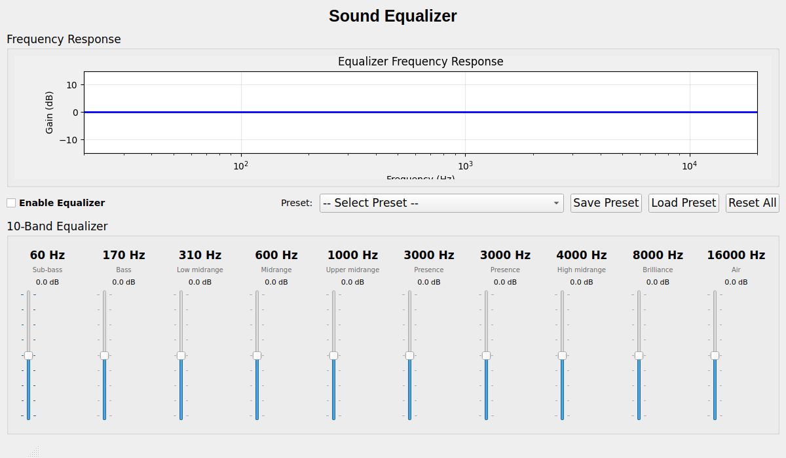

# Sound Equalizer GUI

A modern, user-friendly graphical interface for the Sound Equalizer.



## Features

- **10-Band Equalizer**: Precise control over 10 frequency bands (60 Hz to 16 kHz)
- **Real-time Frequency Visualization**: See your EQ curve as you adjust it
- **Preset Management**: 8 built-in presets (Flat, Bass Boost, Treble Boost, Vocal, Classical, Rock, Jazz, Electronic)
- **Custom Presets**: Save and load your own custom EQ settings
- **Enable/Disable Toggle**: Quickly A/B compare with and without EQ
- **Modern UI**: Clean, intuitive interface built with PyQt5

## Installation

### Requirements

```bash
# Install system dependencies (Debian/Ubuntu)
sudo apt-get update
sudo apt-get install python3 python3-pip portaudio19-dev

# Install Python dependencies
pip install -r requirements.txt
```

### Dependencies

- Python 3.8+
- PyQt5
- matplotlib
- numpy
- scipy
- pyaudio (optional, for real-time audio processing)

## Usage

### Running the GUI

From the project root directory:

```bash
cd python-equalizer
python3 equalizer_gui.py
```

Or from anywhere:

```bash
python3 /path/to/Sound-Equalizer/python-equalizer/equalizer_gui.py
```

### Using the GUI

1. **Adjust Bands**: Move the sliders up (boost) or down (cut) to adjust each frequency band
2. **Apply Presets**: Select a preset from the dropdown to quickly apply a pre-configured EQ
3. **Enable EQ**: Check the "Enable Equalizer" box to activate the EQ (note: requires PyAudio for real-time audio)
4. **Save Settings**: Click "Save Preset" to save your current settings to a JSON file
5. **Load Settings**: Click "Load Preset" to load a previously saved preset
6. **Reset**: Click "Reset All" to set all bands back to 0 dB

## Frequency Bands

The equalizer provides control over 10 frequency bands:

| Band | Frequency | Description |
|------|-----------|-------------|
| 1 | 60 Hz | Sub-bass |
| 2 | 170 Hz | Bass |
| 3 | 310 Hz | Low midrange |
| 4 | 600 Hz | Midrange |
| 5 | 1 kHz | Upper midrange |
| 6 | 3 kHz | Presence |
| 7 | 4 kHz | High midrange |
| 8 | 8 kHz | Brilliance |
| 9 | 16 kHz | Air |

Each band can be adjusted from -12 dB to +12 dB.

## Built-in Presets

### Flat
No equalization - all bands at 0 dB. Use this as a starting point or to disable EQ.

### Bass Boost
Enhanced bass response for genres like hip-hop, EDM, or when using small speakers.

### Treble Boost
Enhanced treble response for added clarity and detail in the high frequencies.

### Vocal
Optimized for vocal-focused content like podcasts, audiobooks, or vocal-heavy music.

### Classical
Balanced sound for classical music with emphasis on natural instrument timbre.

### Rock
Punchy sound with enhanced bass and treble, perfect for rock music.

### Jazz
Warm, balanced sound optimized for jazz with emphasis on midrange and highs.

### Electronic
Enhanced bass and highs for electronic music genres (EDM, house, techno, etc.).

## Custom Presets

### Saving a Preset

1. Adjust the equalizer bands to your desired settings
2. Click "Save Preset"
3. Choose a location and filename (will be saved as .json)
4. Click "Save"

### Loading a Preset

1. Click "Load Preset"
2. Navigate to your saved preset file (.json)
3. Click "Open"
4. The settings will be applied immediately

### Preset File Format

Presets are saved as JSON files with the following structure:

```json
{
  "description": "My Custom Preset",
  "gains": [3.0, -2.0, 1.5, 0.0, -1.0, 2.5, 0.5, -0.5, 1.0, -1.5],
  "bands": [...]
}
```

## Building a Standalone Executable

To create a standalone executable that doesn't require Python to be installed:

```bash
# Install PyInstaller
pip install pyinstaller

# Build the executable
pyinstaller equalizer_gui.spec

# The executable will be in the dist/ directory
./dist/sound-equalizer-gui
```

The generated executable includes all dependencies and can be distributed to users who don't have Python installed.

## Troubleshooting

### GUI doesn't start

**Error**: `Could not load the Qt platform plugin "xcb"`

**Solution**: Install Qt dependencies:
```bash
sudo apt-get install libxcb-xinerama0 libxcb-cursor0
```

### No audio processing

**Issue**: Equalizer doesn't process audio even when enabled

**Explanation**: The current MVP GUI provides visualization and preset management but doesn't include real-time audio processing. To use the equalizer with real-time audio, you need:

1. PyAudio properly installed
2. Proper audio device configuration
3. Root access or proper permissions for audio capture

For production use, consider using the command-line equalizer:
```bash
python3 equalizer.py
```

### High CPU usage

**Solution**: The visualization updates every 500ms. If you experience high CPU usage, you can modify the update interval in `equalizer_gui.py`:

```python
self.viz_timer.start(1000)  # Update every 1000ms (1 second) instead of 500ms
```

## Technical Details

### Architecture

The GUI is built using:
- **PyQt5**: Modern Qt5 bindings for Python
- **Matplotlib**: For frequency response visualization
- **Integration**: Uses the existing `SoundEqualizer` and `AudioProcessor` classes

### Code Structure

- `equalizer_gui.py`: Main GUI application
- `FrequencyVisualization`: Matplotlib widget for frequency response plot
- `EqualizerBandControl`: Individual band slider widget
- `EqualizerGUI`: Main window coordinating all components

## Development

### Running Tests

```bash
# Run GUI tests
QT_QPA_PLATFORM=offscreen python3 -m pytest tests/test_gui.py -v

# Run all tests
python3 -m pytest tests/ -v
```

### Code Style

The code follows PEP 8 style guidelines. To check:

```bash
pylint python-equalizer/equalizer_gui.py
black --check python-equalizer/equalizer_gui.py
```

## Contributing

Contributions are welcome! See [CONTRIBUTING.md](../CONTRIBUTING.md) for guidelines.

### Potential Improvements

- Real-time audio processing integration
- More visualization options (spectrum analyzer, waveform)
- Keyboard shortcuts
- Undo/redo functionality
- More preset categories
- Theme customization
- MIDI controller support

## License

This project is licensed under the MIT License - see [LICENSE](../LICENSE) for details.

## Acknowledgments

- PyQt5 for the excellent GUI framework
- Matplotlib for visualization capabilities
- The open-source audio processing community
